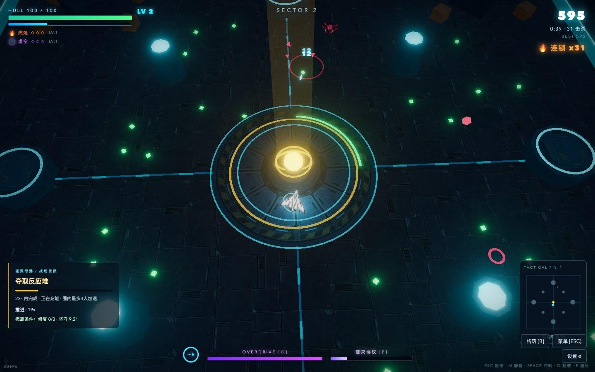

# VOID PULSE

**穿过虫潮，夺回反应堆。带着你的武器构筑活到撤离。**

一款霓虹科幻风格的俯视角生存射击游戏。在四个各具危险的战场上驾驶无人战机，回收碎片、选择强化，让脉冲枪进化为贯穿虫群的湮灭射线。独自出击，或与同一局域网的朋友组成 2–4 人小队。

**[立即试玩 →](https://gamedev4funs.github.io/void-pulse/)** · [组队指南](#和朋友一起玩) · [驾驶员手册](docs/PLAYER_GUIDE.md) · [English](README.en.md)

浏览器打开即玩，无需安装或注册。在线试玩支持单人；组队需要一位玩家运行本地服务。



## 这次出击，怎么打？

- **在撤离与贪一波之间做选择。** 生存至少 10 分钟、完成 3 次反应堆修复即可完成任务；也可以保留本局构筑，继续无尽挑战。
- **把火力拼成自己的打法。** 升级时三选一，搭配燃烧、雷霆、虚空三条流派。五种武器各有进化形态：环绕飞刃、连锁闪电、追踪导弹……从应付眼前的虫群，到打出成片的连锁击杀。
- **不只绕圈，还要抢下目标。** 虫潮之间冲进反应堆光环，守住修复进度；看清危险预警，留一次冲刺脱身，在包围中用超载冲击波解围。
- **一起升级，各自搭配。** 小队共享经验，每个人独立选卡。队友倒地时靠近可加速修复；只要还有人撑住，就有重返战场的机会。

## 四个战场，四种压力

| 战场 | 你将面对什么 |
| --- | --- |
| **能源母港** | 在掩体间穿行，避开周期放电。适合第一次出击。 |
| **霜环星** | 冰锥弹幕与减速寒潮，用更灵活的冲刺寻找空隙。 |
| **熔核星** | 自爆蜂、重甲敌人与熔岩喷涌，用更强的火力打出突破口。 |
| **孢林星** | 分裂虫群、蛛网和孢子毒区，别让退路被封死。 |

## 第一次上手

选择 **能源母港 → 单机出击**。武器会自动开火，默认自动瞄准；先移动拾取绿色碎片，选择第一次强化，再跟随指引前往反应堆。

| 操作 | 按键 |
| --- | --- |
| 移动 | WASD / 方向键 |
| 冲刺穿过敌群 | Space / Shift |
| 超载冲击波 / 湮灭协议 | Q / E（充能后使用） |
| 切换自动瞄准与鼠标瞄准 | F |
| 查看构筑与进化配方 | B |
| 菜单 / 单机暂停 | Esc / P |

触屏设备提供虚拟摇杆和技能按钮。设置中可调整音量、开启低画质，以及减少震屏与闪光。完整操作和进化配方见[驾驶员手册](docs/PLAYER_GUIDE.md)。

## 和朋友一起玩

支持 **2–4 人局域网合作**。选一位房主，在装有 Python 3 的电脑上下载本仓库并解压，进入目录运行：

```bash
python3 scripts/server.py
```

macOS 也可双击 `start.command`；已安装 npm 的玩家可用 `npm start`。

1. 所有人连接同一局域网，用浏览器打开 `http://<房主的局域网IP>:8123`（房主自己也可打开 `http://localhost:8123`）。
2. 房主选择 **组队联机 → 创建房间**，把房名和密码告诉队友。
3. 队友加入房间，房主选择战场并开战。

没有队友伤害。联机选卡时战斗继续，记得替队友留出空间。GitHub Pages 上的在线试玩没有联机中继，组队请使用房主的本地地址。

## 反馈与参与

遇到问题，或有想尝试的打法与建议？欢迎[提交反馈](https://github.com/GameDev4Funs/void-pulse/issues)。报告问题时请附上浏览器、设备、单人或联机模式，以及复现步骤；截图也很有帮助。

想研究实现或参与开发，请看[开发与部署](docs/DEVELOPMENT.md)。游戏使用 Three.js，源码以 [MIT License](LICENSE) 开放；第三方许可见 [Three.js LICENSE](vendor/three/LICENSE)。
